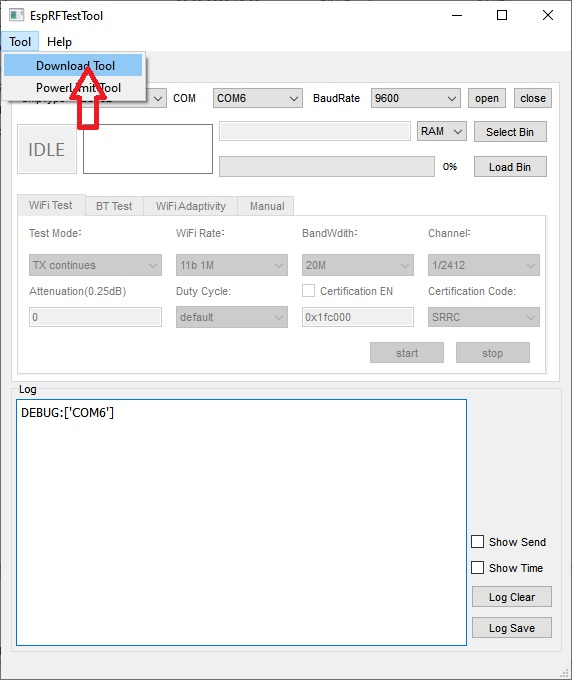
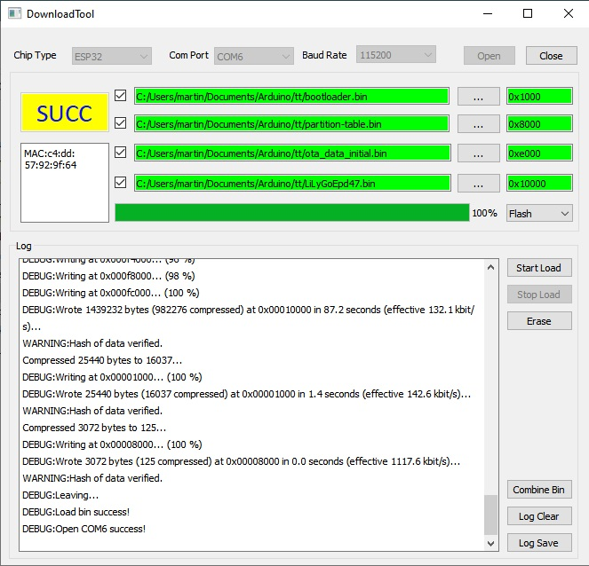

First installation with ESP-RFTest Tool
For fist tile firmware insallation yor nide flash tool from ESP-RF.
Afterwards you can flash by WiFi OTA Interface (included in the firmware).

<table>
  <tr>
      <td>
        <li>Download as zip "ESP RF Test Tool and Test Guide" from https://www.espressif.com/en/support/download/other-tools</li>
        <li>Start "ESP RF Test Tool.</li>
        <li>Start Download Tool from Menu Tools</li>
      <td>
  </tr>  
  <tr>
    <td>
      
    </td>  
  </tr>  
  <tr>
      <td>
        <li>connect USB Port with your device</li>
        <li>ChipType: ESP32</li>
        <li>Com Port: COM_ (your com port)</li>
        <li>Baud Rate: 115200</li>
        <li>Click "Open" button</li>
        <li>Change Combo Box from RAM into Flash</li>
        <li>Now your can choos binary files</li>
        <li>select the binary files and dhe adessis like the pictore</li>
        <li>clic "Start Load"</li>
      <td>
  </tr>  
  <tr>
    <td>
      
    </td>  
  </tr>  
  
</table>  
